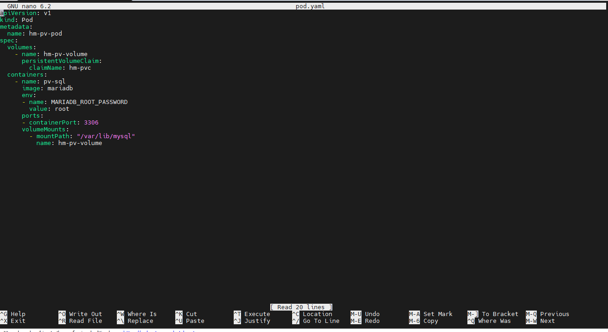
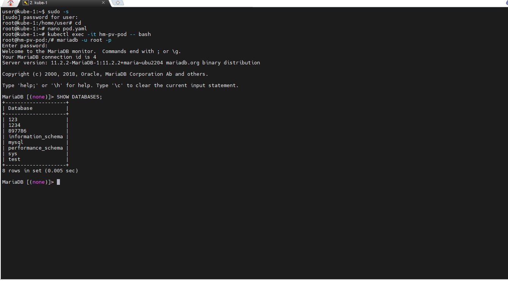
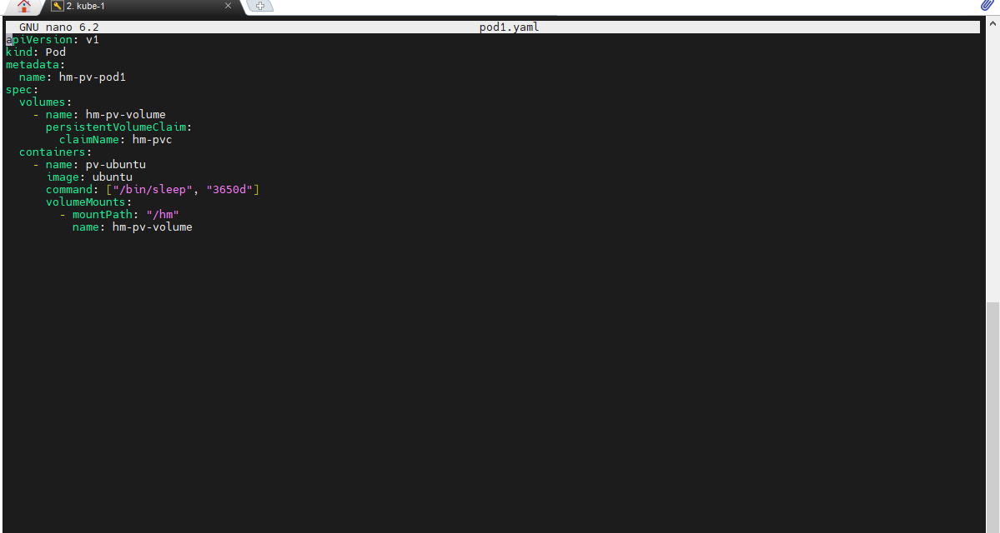
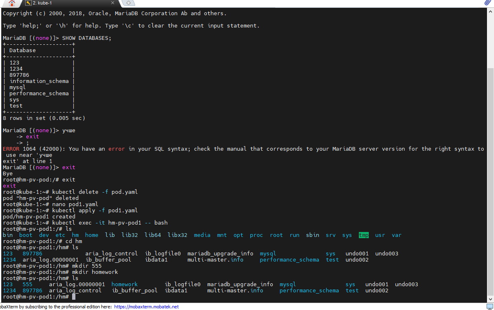
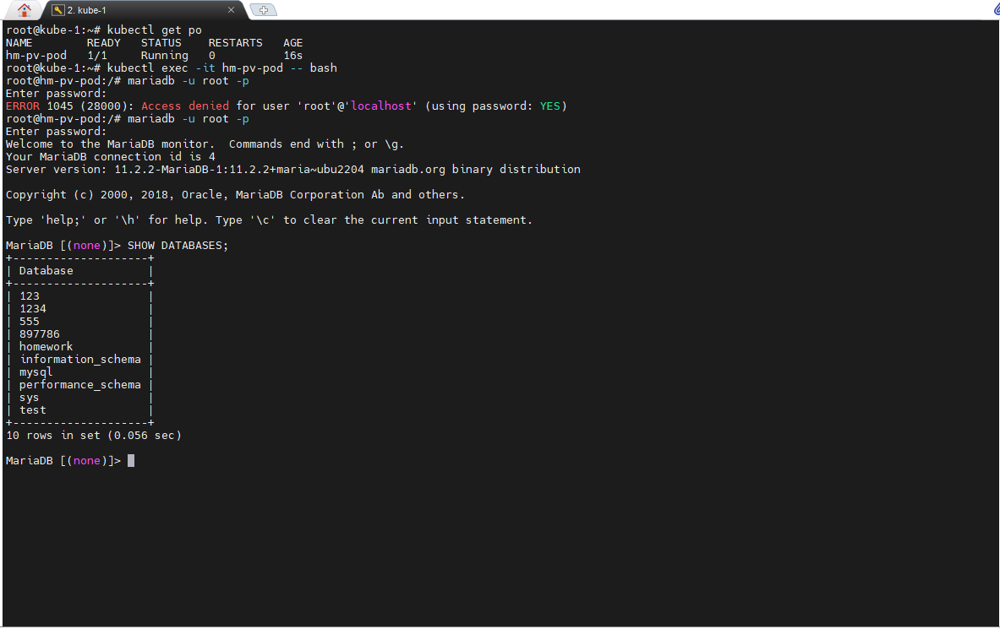

# Cоздать различные SC, PV, PVC и подключить к ним различные контейнеры:БД (создать, инициализировать, заполнить данными), просто контейнер, который будет записывать в файл любую строку. Один и тот же PV по очереди подключать к разным Подам и проверять до записи, что данные сохранились. После изменения данных другим подом, снова подключить БД и проверить, что она все еще работает.

## 1. Создадим SC с помощью файла sc.yaml

## проверим что StorageClass создан, командой *kubectl get sc"*

## 2. Создадим PV с помощью файла pv.yaml

## проверим что Persistent Volume создан, командой *kubectl get pv*

## 3. Создадим PVC с помощью файла pvc.yaml

## проверим что Persistent Volume Claim создан, командой *kubectl get pvc*

## 4. Создадим pod с базой данных MariaDB с помощью файла pod.yaml

## зайдем в контенер с базой данных с помощью команды *kubectl exec -it hm-pv-pod -- bash*, зайдем в СУБД, создадим базу данных **homework** и таблицу **book** в ней.

## ## Остановим pod командой *kubectl delete pod hm-pv-pod*/
## Если внимательно посмотрет на фал манифеста для СУБД, то мы увидим не совсем корректное монтирование папки, папка примонтируется, но после остановки пода базы данных удалятся, остануться только те файлы которые мысоздали в примонтированной папке, что бы этого избежать, нам необходимо монтировать папку, которую по умолчанию использует наша СУБД.
 
## Так будет выглядеть новый файл манифеста, зайдем в созданный POD, создадим базу данных и таблицу, а заодно увидим что старой БД у нас к сожалению нет.

## Мы создали базу с именем test, и видим на скриноте, что базы данных с именем homewrok нет.
## Остановим pod командой *kubectl delete pod hm-pv-pod*.
## 5. Создадим новый pod с ОС Ubuntu c помощью файла pod1.yaml

## Зайдем в pod командой *kubectl exec -it hm-pv-pod1 -- bash* и создадим в примонтированной директории /hm еще 2 каталога **555** и **homework**

## Останавливаем pod и запускаем pod с MariaDB. проверяем работаспособность нашей базы данных.

## Таким образом видим, что после повторного запуска, база данных "test" сохранилась, так же директории которые мы создали в другом поде MariaDB тоже определяет как базы данных.

