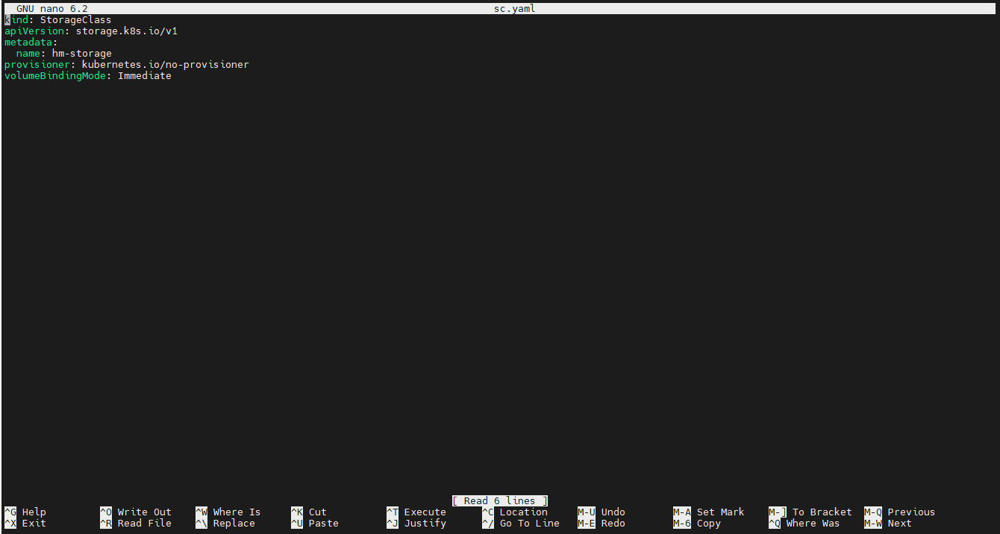
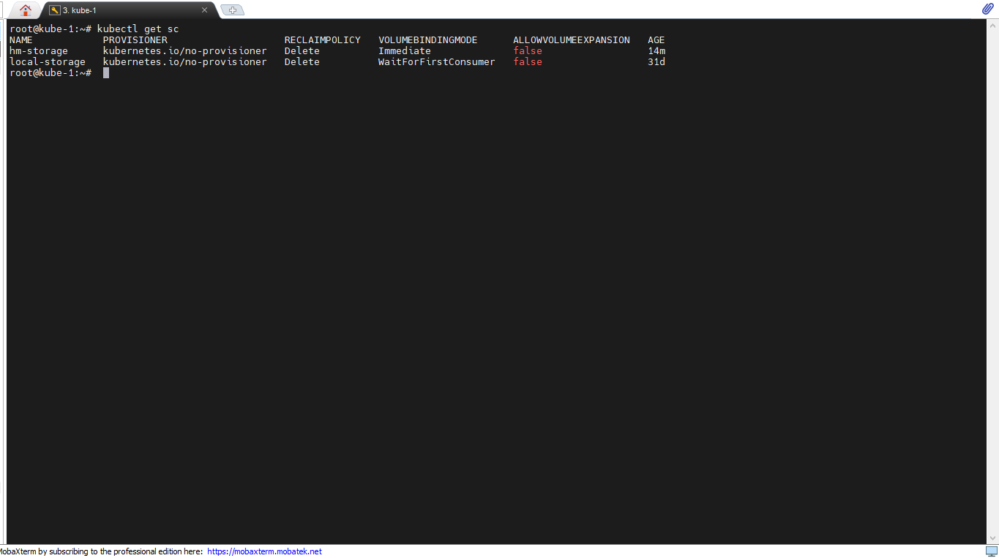
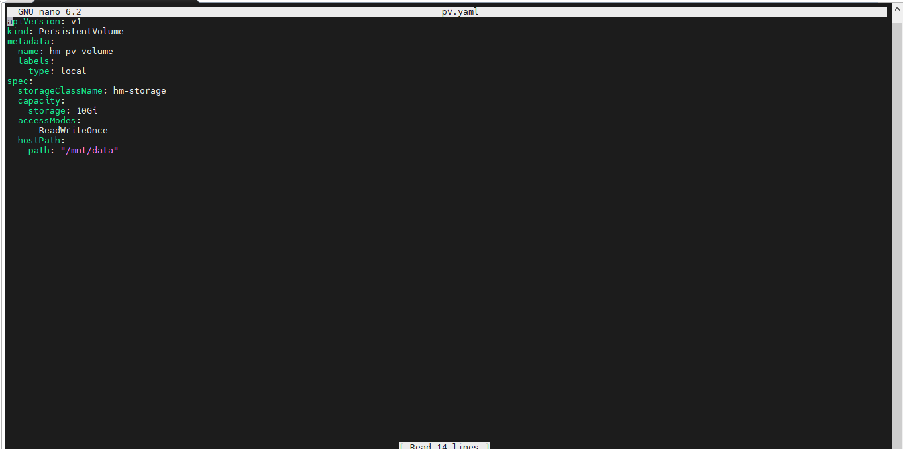
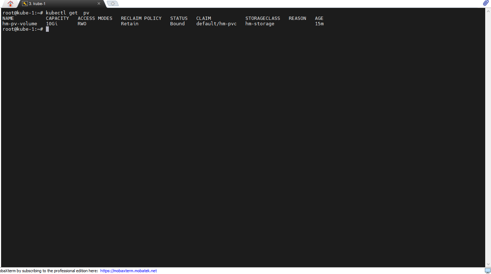
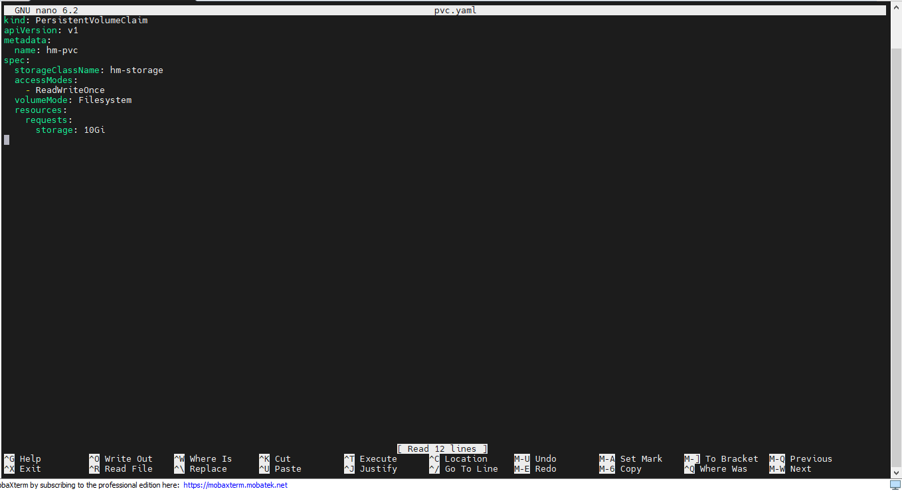
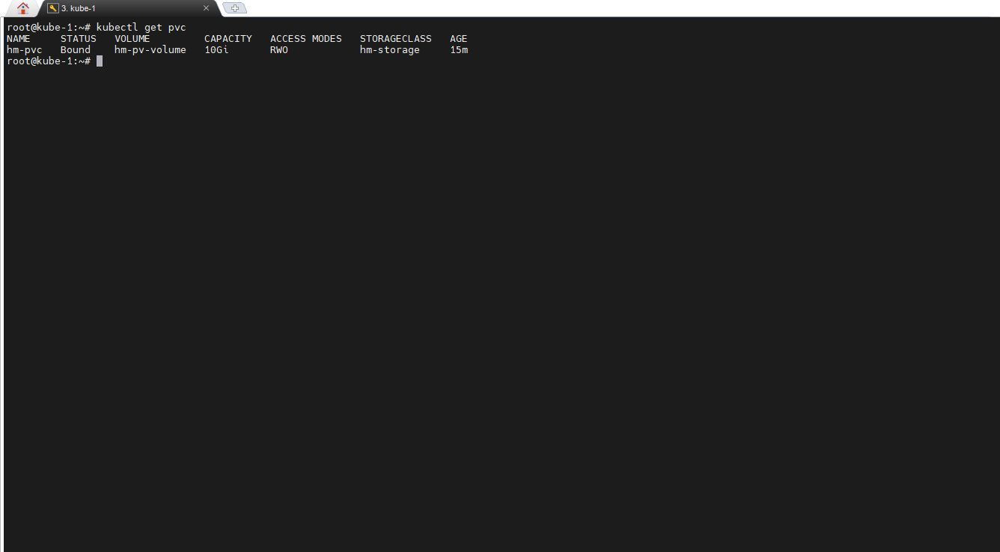
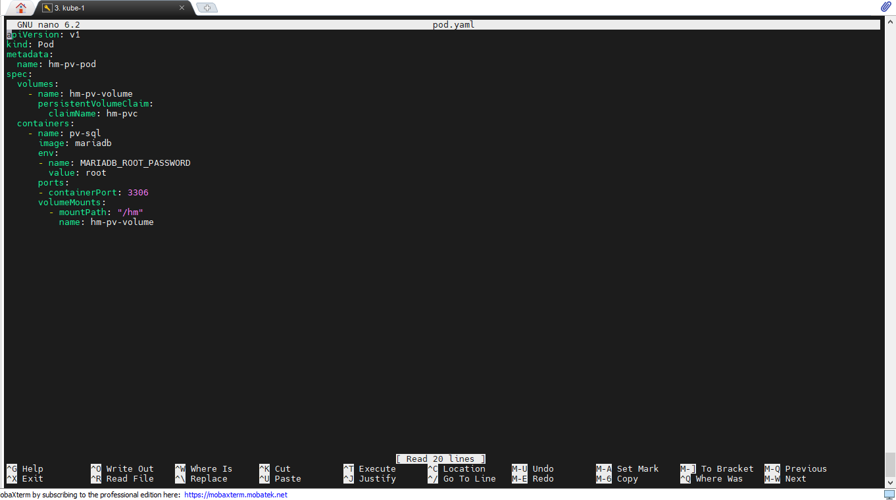
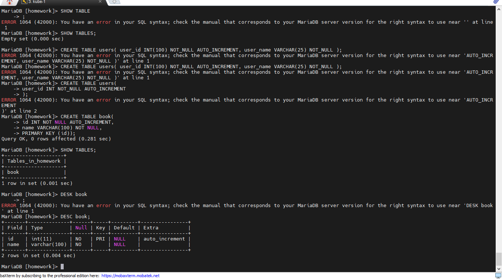

# Cоздать различные SC, PV, PVC и подключить к ним различные контейнеры:БД (создать, инициализировать, заполнить данными), просто контейнер, который будет записывать в файл любую строку. Один и тот же PV по очереди подключать к разным Подам и проверять до записи, что данные сохранились. После изменения данных другим подом, снова подключить БД и проверить, что она все еще работает.

## 1. Создадим SC с помощью файла sc.yaml

## проверим что StorageClass создан, командой *kubectl get sc"*

## 2. Создадим PV с помощью файла pv.yaml

## проверим что Persistent Volume создан, командой *kubectl get pv*

## 3. Создадим PVC с помощью файла pvc.yaml

## проверим что Persistent Volume Claim создан, командой *kubectl get pvc*

## 4. Создадим pod с базой данных MariaDB с помощью файла pod.yaml

## зайдем в контенер с базой данных с помощью команды *kubectl exec -it hm-pv-pod -- bash*, зайдем в СУБД, создадим базу данных **homework** и таблицу **book** в ней.

## Остановим pod командой *kubectl delete pod hm-pv-pod*.
